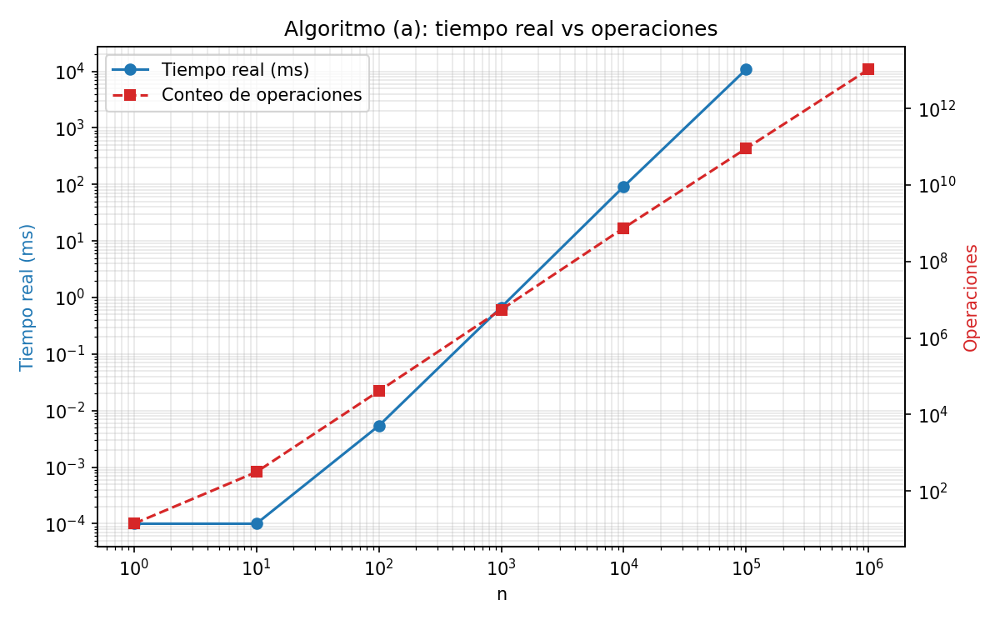
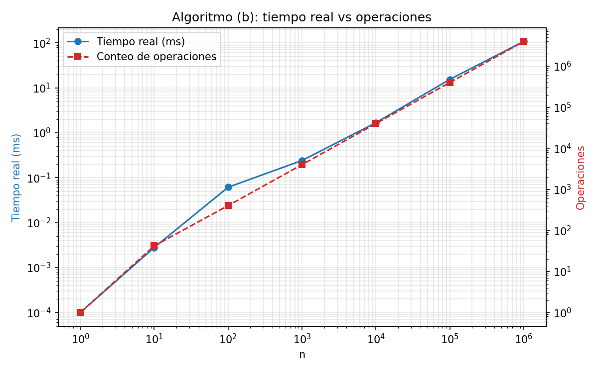
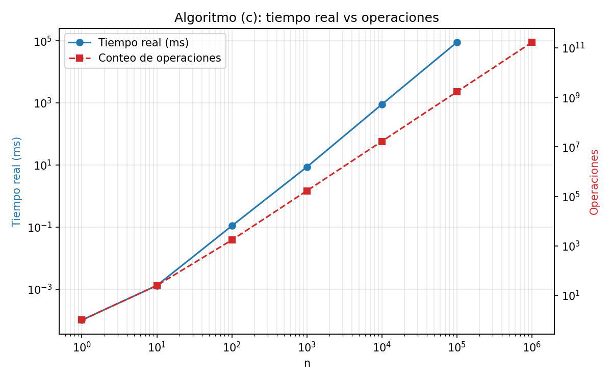

# Laboratorio 7 – Ejercicio 2: profiling y conteo de operaciones

Teoría de la Computación (CC2019), UVG. Los tres algoritmos del ejercicio 1 están programados en Java. Para cada tamaño de entrada se mide el tiempo real y se cuenta el número de operaciones.

## Cómo ejecutar

Desde esta carpeta (`ejercicio2/`):

```
javac -d out src/*.java
java -cp out Main
python graficar.py
```

- `Main` escribe `resultados/resultados.csv` (tarda ~2 minutos, casi todo en el algoritmo (c) con n = 100,000).
- `graficar.py` lee el CSV y genera `resultados/grafica_A.png`, `grafica_B.png`, `grafica_C.png` y `resultados/tabla.md`. Requiere `matplotlib`.
- No se usa `java src/Main.java` porque, en Java 21, ese modo solo compila un archivo y no encuentra las otras clases.

## Cómo se mide

- **Tiempo real**: `System.nanoTime()`, con calentamiento de la JVM (20 corridas con n = 1000) antes de medir. Se toma la **mediana** de 21 repeticiones para n ≤ 1000, de 5 para n = 10,000 y una sola corrida para n ≥ 100,000.
- **`printf`**: en (b) y (c) se imprime a un `PrintStream` con buffer que descarta la salida, para que la consola no domine el tiempo. La instrucción se ejecuta igual.
- **Conteo de operaciones**: un contador `ops` dentro del código, con las mismas reglas del ejercicio 1: cada comprobación de ciclo cuenta 1 (iteraciones + 1 en un ciclo que termina por su condición), y cada instrucción del cuerpo (`counter++`, `printf`, `break`, `if (n <= 1)`) cuenta 1. La inicialización de los índices de los ciclos no cuenta; `counter = 0` en (a) sí cuenta.
- **Fórmula exacta**: cada algoritmo trae `formula(n)`, que calcula T(n) sin ejecutar los ciclos. `Main` compara `ops` contra `formula` en cada tamaño medido y avisa si difieren. En la corrida final **no hubo diferencias**.
- **Tamaños no medidos**: (a) y (c) con n = 1,000,000 no se ejecutaron (ver más abajo). Su conteo de operaciones sale de `formula(n)` y el tiempo aparece como "no medido" (`medido=false` en el CSV). (b) sí se midió en todos los tamaños.

## Resultados

Tiempos en milisegundos, medidos en una sola máquina (los valores absolutos dependen del equipo). Los tiempos de n = 1 y n = 10 están cerca de la resolución del reloj de Windows (~0.0001 ms) y no son medidas precisas.

### Algoritmo (a)

| n | Tiempo real (ms) | Operaciones |
|---:|---:|---:|
| 1 | 0.0001 | 14 |
| 10 | 0.0001 | 314 |
| 100 | 0.0054 | 40,904 |
| 1,000 | 0.6763 | 5,512,004 |
| 10,000 | 91.7071 | 750,160,004 |
| 100,000 | 10,840.4825 | 90,001,900,004 |
| 1,000,000 | no medido | 10,500,022,000,004 |



### Algoritmo (b)

| n | Tiempo real (ms) | Operaciones |
|---:|---:|---:|
| 1 | 0.0001 | 1 |
| 10 | 0.0028 | 42 |
| 100 | 0.0615 | 402 |
| 1,000 | 0.2422 | 4,002 |
| 10,000 | 1.6826 | 40,002 |
| 100,000 | 15.5025 | 400,002 |
| 1,000,000 | 108.2889 | 4,000,002 |



### Algoritmo (c)

| n | Tiempo real (ms) | Operaciones |
|---:|---:|---:|
| 1 | 0.0001 | 1 |
| 10 | 0.0013 | 25 |
| 100 | 0.1088 | 1,717 |
| 1,000 | 8.5670 | 167,167 |
| 10,000 | 890.8118 | 16,671,667 |
| 100,000 | 88,977.1439 | 1,666,716,667 |
| 1,000,000 | no medido | 166,667,166,667 |



Las gráficas usan escala log-log con dos ejes (tiempo a la izquierda, operaciones a la derecha). Como las unidades son distintas, lo que se compara es la **pendiente** de las curvas, no su altura.

## Análisis

### Tiempo real vs operaciones

Al multiplicar n por 10 (de 10^4 a 10^5, donde ambos datos están medidos):

| Algoritmo | Crecimiento de ops | Crecimiento del tiempo | Clase esperada (ej. 1) |
|---|---:|---:|---|
| (a) | ×120.0 | ×118.2 | Θ(n² log n) |
| (b) | ×10.0 | ×9.2 | Θ(n) |
| (c) | ×100.0 | ×99.9 | Θ(n²) |

El tiempo real crece al mismo ritmo que el conteo de operaciones en cada algoritmo, lo que confirma las clases del ejercicio 1: (a) Θ(n² log n), (b) Θ(n), (c) Θ(n²). En (a), el factor ×120 (y no ×100) es la señal del `log n`.

### El tiempo por operación no es igual entre algoritmos

Que el tiempo siga al conteo dentro de un mismo algoritmo no significa que dos algoritmos con igual conteo tarden lo mismo. En n = 100,000:

- (a): ~0.12 ns por operación. El cuerpo es solo `counter++` y la JVM lo optimiza muy bien.
- (c): ~53 ns por operación. Cada iteración interna hace un `println`.
- (b): ~39 ns por operación (también con `println`).

Por eso (c) tarda 89 s con 1.7×10^9 operaciones y (a) tarda 11 s con 9×10^10. Contar operaciones ignora que unas instrucciones cuestan mucho más que otras; ese es el supuesto de "tiempo constante por instrucción" de la teoría.

### Ruido en n pequeños

Para n ≤ 100 los tiempos son del orden de microsegundos o menos, y dominan la resolución del reloj y el comportamiento de la JIT. En (b) se ve una pequeña desviación en n = 100 y n = 1000 respecto a la línea recta. Por eso se usa la mediana de varias repeticiones, y aun así estos puntos no se deben sobre-interpretar.

### n = 1,000,000 en (a) y (c)

No se ejecutaron: el conteo (10.5×10^12 en (a) y 1.67×10^11 en (c)) implica tiempos muy largos. Una estimación grosera, escalando desde n = 100,000 con el factor de operaciones, daría unos 21 minutos para (a) y unas 2.5 horas para (c). Son estimaciones, **no mediciones**, y por eso la tabla dice "no medido".

## Comparación con el ejercicio 1

Las T(n) del compañero se verificaron contra el conteo real del programa.

- **(b)**: T(n) = 4n + 2 (y 1 si n ≤ 1) coincide exactamente con el programa en todos los tamaños.
- **(c)**: la resolución usa n/4 como número de vueltas del ciclo con `j += 4`, pero la cuenta real es ⌈n/4⌉. T(n) = n²/6 + 2n/3 + 1 solo es exacto cuando n es múltiplo de 12 (n/3 y n/4 enteros); para n = 10 da 24.33 y el programa cuenta 25. La forma exacta es 2ab + 2a + 1 con a = ⌊n/3⌋ y b = ⌈n/4⌉. La clasificación Θ(n²) no cambia.
- **(a)**: su fórmula usa log₂ n vueltas para el ciclo de k, pero la cuenta real es ⌊log₂ n⌋ + 1. Solo coincide exactamente con potencias de 2 (n = 2 y n = 16 dan igual). Para n = 10, 100, 1000 y 10000 se separa entre 1% y 10% del valor real. La clasificación Θ(n² log n) no cambia.

## Estructura

```
ejercicio2/
├── README.md
├── graficar.py
├── src/
│   ├── Main.java        # corre los tres algoritmos y escribe el CSV
│   ├── AlgoritmoA.java  # algoritmo (a) + formula(n)
│   ├── AlgoritmoB.java  # algoritmo (b) + formula(n)
│   └── AlgoritmoC.java  # algoritmo (c) + formula(n)
└── resultados/
    ├── resultados.csv
    ├── tabla.md
    └── grafica_A.png, grafica_B.png, grafica_C.png
```
